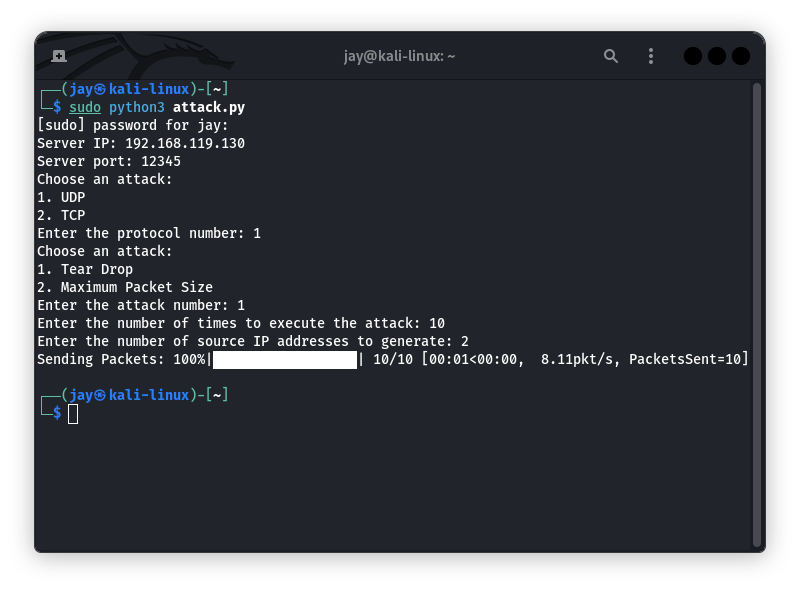
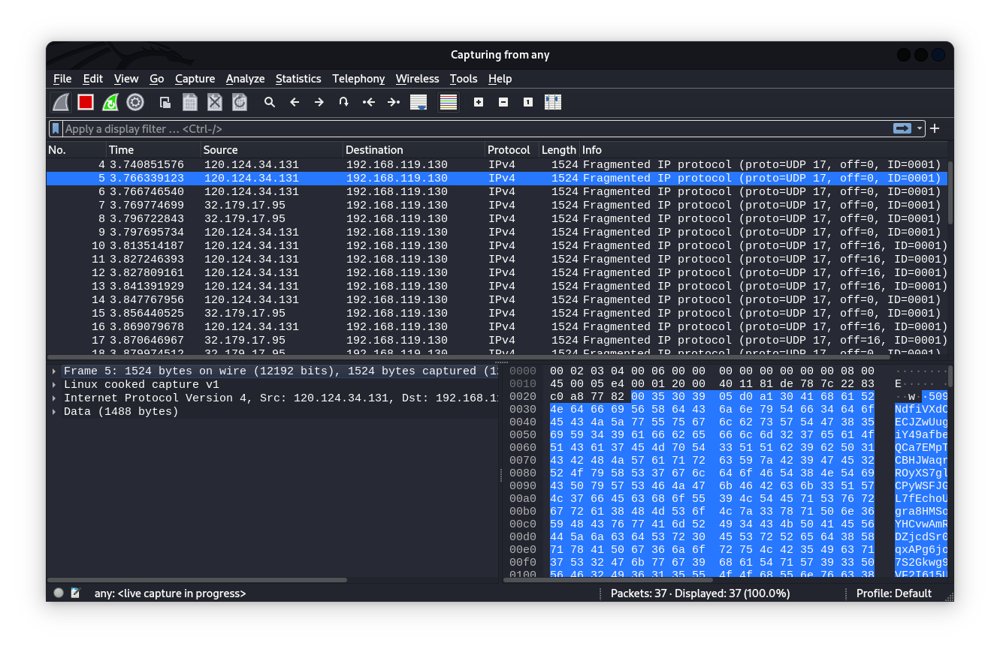
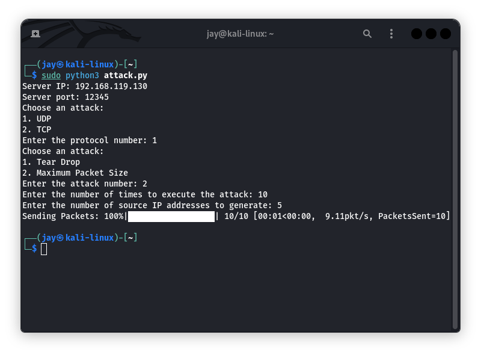
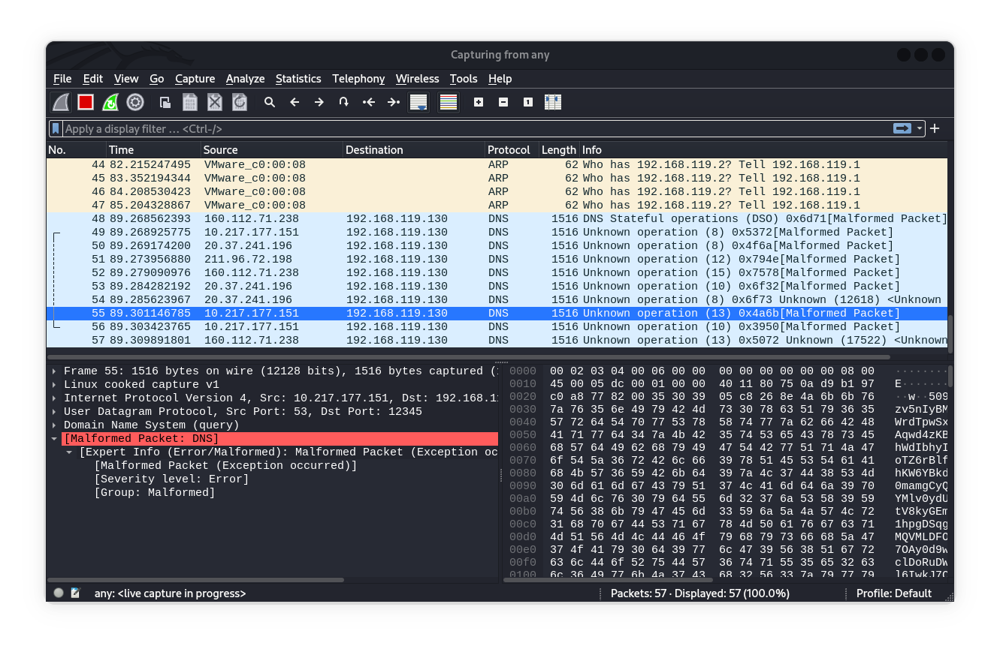
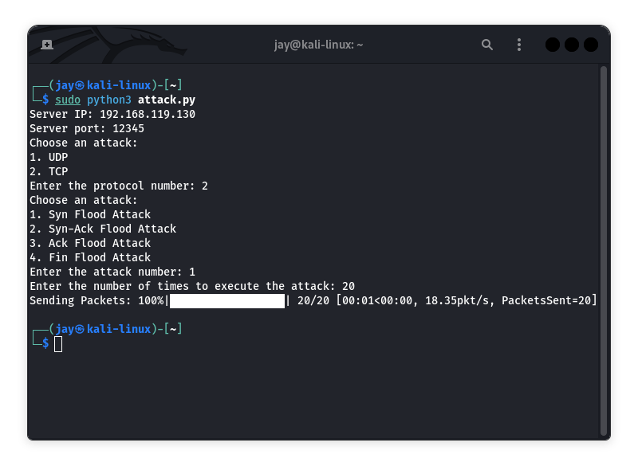
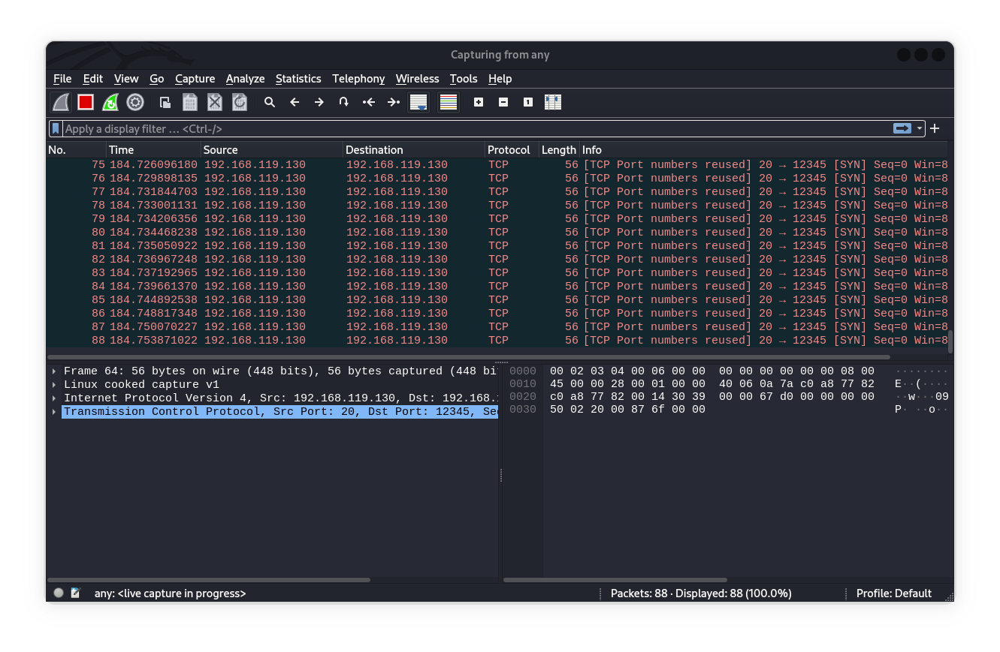
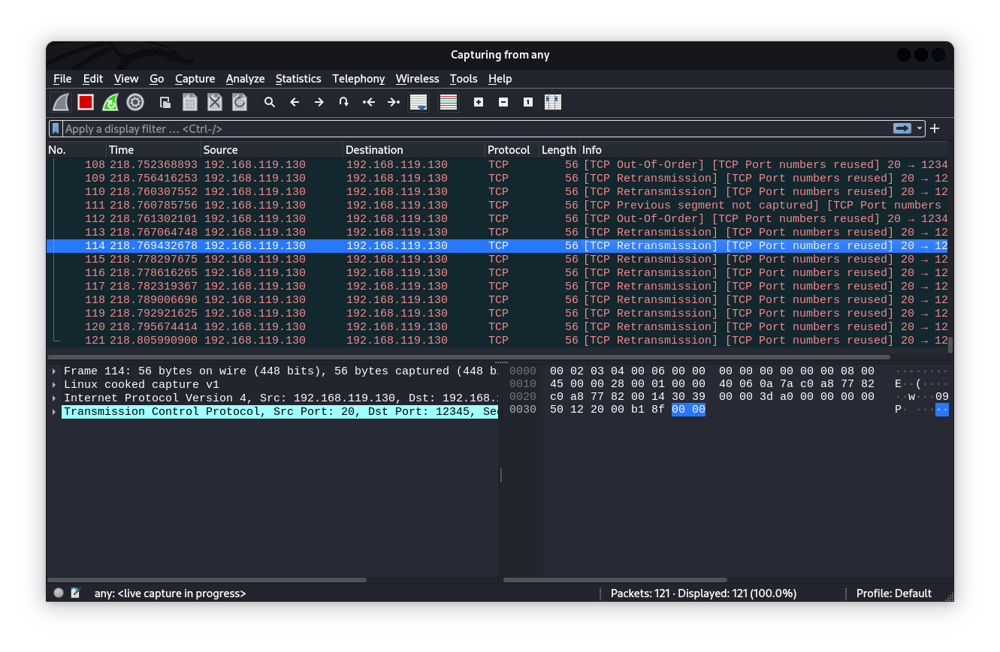
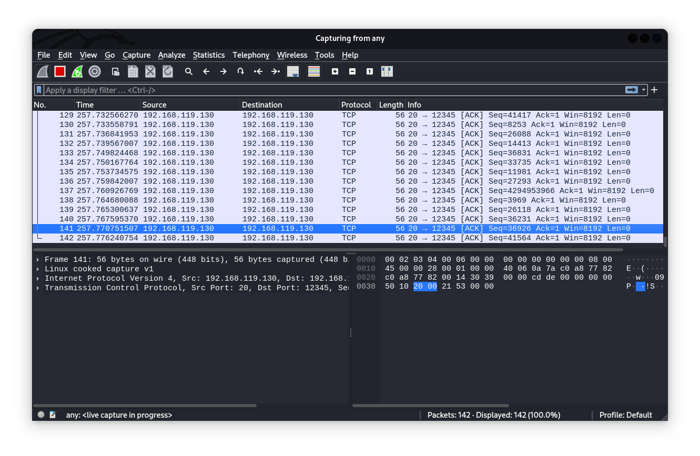
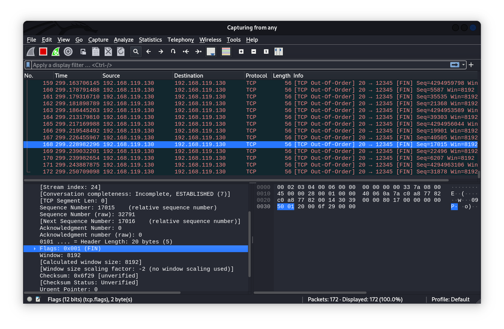

# **DDoS Attack and Detection Tool: Project Report**

<p align="center">
  
  
  
  
  
  
  
  
</p>

This repository contains Python scripts that demonstrate both DDoS (Distributed Denial of Service) attack techniques implemented using the Scapy library, and a DDoS detection and prevention system. Scapy is a powerful packet manipulation and network analysis tool. The scripts provide examples of different attack protocols (UDP or TCP) and attack types (Tear Drop, Syn Flood, Syn-Ack Flood, Ack Flood, and Fin Flood). Additionally, the system includes modules for detecting and mitigating these attacks. These scripts are **strictly for educational purposes** and should not be used for malicious activities. DDoS attacks are illegal and unethical.

## **Project Overview**

- **Attack Tool Development:** 
    - Developed the base of the attack code.
    - Implemented UDP attacks including Tear Drop.
    - Created maximum payload size attack to create malformed packets.
    - Implemented random source IP generation to bypass source blocking.
    - Implemented threading to enhance the speed of the attack.
    - Added logging feature to save the results of the attack.

- **Attack Tool Enhancements:**
    - Added progress bar for visualizing attack progress.
    - Implemented TCP attacks including SYN Flood, SYN-ACK Flood, Ack Flood, and Fin Flood.

- **Attack Detection Tool Development:**
    - Implemented initial UPD packet number limitation and source IP blocking.
    - Implemented initial UDP packet rate limiting.
    - Implemented TCP SYN/SYN-ACK/ACK/FIN attack detection and source IP blocking.

- **DDoS Mitigation:**
    - Developed logic for DOS and DDOS attack detection.
    - Attempted DDOS attack mitigation by dropping new incoming packets.
    - Implemented effective DDOS attack mitigation by locking IP addresses based on packet threshold.


## 🎯 Attack Procedures

### 1. Tear Drop Attack
The Tear Drop attack involves sending IP packets with overlapping fragments. This confuses the targeted system, causing it to crash or become unresponsive.

#### **Procedure:**
- Generate random source IP addresses.
- Create two overlapping fragments with randomized payload.
- Send the fragments to the target server.

#### **Screenshots and Packet Captures:**
  
  
- **Wireshark Packet Capture:**
  

### 2. UDP Flood Attack
The UDP Flood attack floods the target server with UDP packets. This overwhelms the server's resources and makes it unreachable for legitimate users.

#### **Procedure:**
- Generate random source IP addresses.
- Create UDP packets with randomized source IP and maximum payload size.
- Send the UDP packets to the target server.

#### **Screenshots and Packet Captures:**
  
- **Wireshark Packet Capture:**
  


### 3. Syn Flood Attack
The Syn Flood attack exploits the TCP protocol's handshake process by sending a flood of SYN packets, overwhelming the server and preventing it from accepting legitimate connections.

#### **Procedure:**
- Send a flood of SYN packets to the target server without completing the TCP handshake.

#### **Screenshots and Packet Captures:**
  
- **Wireshark Packet Capture:**
  


### 4. Syn-Ack Flood Attack
The Syn-Ack Flood attack involves sending a flood of TCP packets with the SYN-ACK flags set, overwhelming the target server and disrupting its operations.

#### **Procedure:**
- Send a flood of TCP packets with SYN-ACK flags set to the target server.

#### **Screenshots and Packet Captures:**
  
- **Wireshark Packet Capture:**
  


### 5. Ack Flood Attack
The Ack Flood attack floods the target server with TCP packets containing only the ACK flag. This attack consumes server resources and affects its performance.

#### **Procedure:**
- Send a flood of TCP packets with only the ACK flag set to the target server.

#### **Screenshots and Packet Captures:**
  
- **Wireshark Packet Capture:**
  


### 6. Fin Flood Attack
The Fin Flood attack sends a large number of TCP packets with the FIN flag set, disrupting the connection and causing the server to spend resources on handling incomplete connections.

#### **Procedure:**
- Send a flood of TCP packets with the FIN flag set to the target server.

#### **Screenshots and Packet Captures:**
  
- **Wireshark Packet Capture:**
  


## 🛡️ DDoS Detection and Prevention

### UDP DDoS Detection

#### Threshold-based Detection

1. **Packet Rate Monitoring:**
   - Incoming UDP packets are monitored for packet rate per IP address.
   - If a client IP exceeds the predefined packet rate threshold, it is considered a potential DDoS attack.

2. **Rate Limiting and Lockout:**
   - Exceeding the packet rate threshold results in a lockout of the client IP for `300 seconds` (5 minutes).

#### Tear Drop Attack Detection

1. **Fragment Analysis:**
   - UDP packets with fragments are analyzed for overlapping offsets, indicating a potential Tear Drop attack.
   - Detected Tear Drop attacks are flagged for further action.
   

### TCP DDoS Detection

#### SYN, SYN-ACK, and FIN Flood Detection

1. **Packet Counting:**
   - Incoming TCP packets are counted separately for SYN, SYN-ACK, and FIN flags per client IP.
   - Counting is done in a rolling window of `5 minutes`.

2. **Threshold-based Detection:**
   - If the number of SYN, SYN-ACK, or FIN packets exceeds the threshold within the rolling window, it is considered a potential flood attack.

3. **Rate Limiting and Lockout:**
   - Client IPs exceeding the threshold are blocked for `30 minutes`.

### Implementation Details

#### Threads and Sniffing

1. **UDP and TCP Processing Threads:**
   - Separate threads are used to process UDP and TCP packets concurrently.
   - Each thread processes packets according to the defined detection logic.

2. **Packet Sniffing:**
   - Scapy is utilized for packet sniffing to capture and analyze incoming TCP packets.
   - Packet handlers identify SYN, SYN-ACK, and FIN packets for counting and analysis.

## ⚙️ Usage and Running the System

### Prerequisites:

- **Python and Required Libraries:**
  - Ensure Python 3.x is installed on your system. You can download Python from the official [Python website](https://www.python.org/downloads/).
  - Install the necessary Python libraries using the following commands:
    ```
    pip install socket
    pip install scapy
    pip install tqdm
    pip install struct
    pip install random
    pip install time
    pip install threading
    ```
  
- **Operating Systems:**
  - The attack tool was developed and tested on Kali Linux.
  - The server code was tested on a Windows operating system.

- **Wireshark (Optional for Packet Analysis):**
  - Wireshark can be used for analyzing the sent packets and ensuring proper functioning of the tools. You can download Wireshark from the official [Wireshark website](https://www.wireshark.org/download.html).

### Running the Attack Tool:

1. Clone the attack tool repository from GitHub.
2. Navigate to the attack tool directory in your terminal or command prompt.
3. Ensure Python and the required libraries are installed (as mentioned in the prerequisites).
4. Execute the attack tool script using Python by running the following command:
    ```
    sudo python3 attack_tool.py
    ```
5. Follow the prompts to input the target server IP, port, and attack type.

#### Logging Implementation:

- **Logging Attack Details:**
  - The attack tool is equipped with a logging feature that captures essential attack details, including the target IP, attack type, and timestamp.
  - Attack results and progress are logged in real-time, providing valuable insights into the attack process.


### Running the Detection Tool:

1. Clone the detection tool repository from GitHub.
2. Navigate to the detection tool directory in your terminal or command prompt.
3. Ensure Python and the required libraries are installed (as mentioned in the prerequisites).
4. Execute the detection tool script using Python by running the following command:
    ```
    python3 server.py
    ```
5. The tool will automatically start monitoring incoming traffic and detect DDoS attacks.

**Note:** It's recommended to run the tools in a controlled environment for testing and educational purposes only.


---
